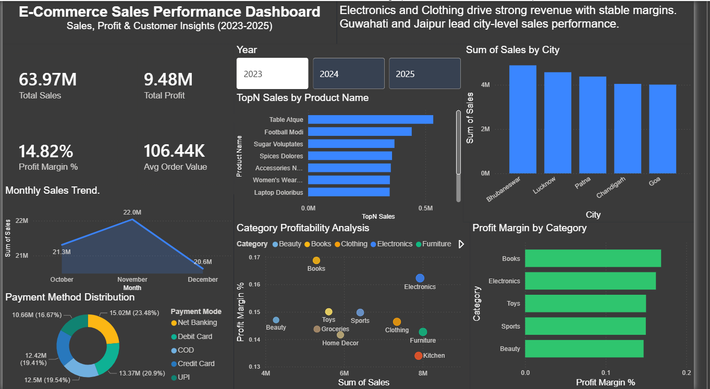

# E-Commerce Sales Performance Dashboard

## Project Overview

This project analyzes e-commerce sales performance using Power BI.
The dashboard provides insights into sales trends, top-selling products, city-wise revenue distribution, and category profitability.

## Dashboard Preview

## Key Insights

* Electronics and Clothing drive strong revenue with stable margins.
* Toys category shows higher profitability relative to sales volume.
* Guwahati and Jaipur lead city-level sales performance.

## Features

* Sales trend analysis by month
* Top-performing products
* City-wise sales distribution
* Category profitability analysis
* Payment method distribution

## Tools Used

* Power BI
* Microsoft Excel / CSV
* Data Visualization

## Files in this Repository

* `Ecommerce-Sales-Dashboard.pbix` → Power BI dashboard file
* `Sales.csv` → dataset used for analysis
* `dashboard-preview.png` → dashboard screenshot
* `README.md` → project documentation

